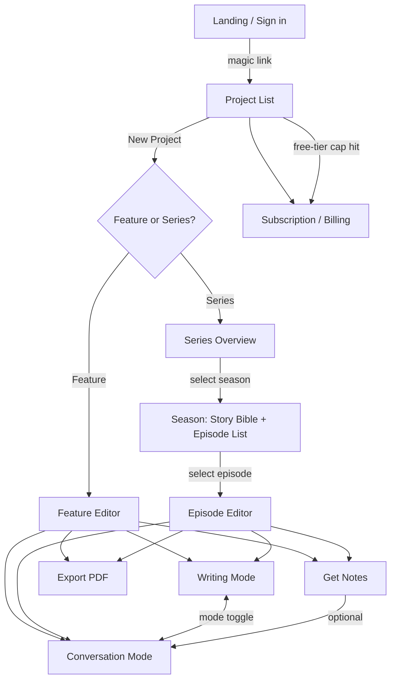

# App Flow: Storycrat

This document maps how a user moves through the app — every top-level screen and the routes between them. Pair with `user-flows.md` (step-by-step journeys) and `DESIGN.md` (visual system for each screen).

## Screen Map

## Screens

### 1. Landing / Sign in
Email input → magic-link sent (Resend) → click link → session created (KV) → redirect to Project List. No password flow exists (PRD §4 Req 33, §7 Auth).

### 2. Project List
Every project the account owns, each tagged Feature or Series. Entry point for creating a new project and for reaching Subscription/Billing. This is where the free-tier cap (one script, lifetime) surfaces if the user tries to create a second project without a subscription (PRD §4 Req 34–35).

### 3. New Project (Feature or Series choice)
A single decision screen: Feature Film (one script) or TV Series (seasons → episodes). This choice sets `project.type` permanently — see PRD §4 Req 2.

### 4. Feature Editor
The screenplay page for a Feature project. Contains the mode toggle (Writing ↔ Conversation) and the Export action. Desktop: centered 850px page, left sidebar collapsed (no season/episode nav needed for a single script). Mobile: single column, bottom bar toggles editor/conversation (DESIGN.md → Layout & Spacing).

### 5. Series Overview
Lists the seasons in a Series project. Entry point to a season's Story Bible and episode list.

### 6. Season View (Story Bible + Episode List)
Two panes: the season-level Story Bible document (PRD §4 Req 6) and the list of episodes in that season. Selecting an episode opens the Episode Editor.

### 7. Episode Editor
Functionally identical to the Feature Editor (same mode toggle, same Export action), scoped to one episode's script. The left sidebar here is expanded to show season/episode navigation, so the writer can jump between episodes without leaving the editor (PRD §4 Req 8; DESIGN.md → Navigation: Project Tree).

### 8. Writing Mode
A view within the Feature/Episode Editor, not a separate route — dictation is active, live transcript streams into the page, Active Recording Bar visible (DESIGN.md → Components: The Editor). Speaking the wake-phrase ("Partner, ...") transiently shifts the Active Recording Bar into Command Mode — same screen, no navigation — for a formatting or editing command, then returns to normal dictation once the command resolves.

### 9. Conversation Mode
A view within the Feature/Episode Editor (desktop: right-hand drawer; mobile: full-screen via bottom bar). Chat interface, scoped to the current script (+ season Story Bible, and semantically retrieved passages from earlier episodes, if applicable). Script Chips link responses back to specific lines, tagged with the source episode when a citation comes from outside the current one (DESIGN.md → Components: AI Conversation).

### 10. Get Notes
Not a separate route — a single action available from either editor, in either mode, that returns one written critique response without opening the Conversation mode drawer/full-screen view at all (PRD §4 Req 38–41). Presented as a static panel, not a chat thread; offers an optional "Continue in Conversation" path into Conversation mode proper (DESIGN.md → Components: AI Conversation).

### 11. Export PDF
Triggered from either editor. Produces a formatted PDF (PRD §4 Req 37), stored in R2, download link returned — not a separate screen, a modal/action with a result state.

### 12. Subscription / Billing
Reached from Project List (proactively, or when the free-tier cap blocks a new script) or from account settings. Shows current plan, upgrade/cancel actions, routes to Polar checkout (PRD §4 Req 36).

## Navigation Rules

- The mode toggle (Writing ↔ Conversation) must never lose state in either mode when switched — this is a persistent UI element, not a page navigation (PRD §4 Req 28). If a voice session is active in either mode when the toggle is used, it stops cleanly rather than rerouting — the writer restarts voice input explicitly in the new mode (PRD §4 Req 46).
- Episode navigation (within a Series) must be reachable from inside any Episode Editor without leaving it (PRD §4 Req 8) — implemented as a collapsible sidebar (desktop) per DESIGN.md, not a separate route the user has to navigate back out to.
- System status states (mic denied, reconnecting, rate-limited) render in-place over whichever screen is active — none of them navigate the user away from their current editor or conversation (PRD §4 Req 32; DESIGN.md → Components: System Status).
- The free-tier TV notice (PRD §4 Req 45) renders inline at the point of TV Series creation (screen 3), not as a later interstitial — it's disclosed before the writer invests in episode 1, not sprung on them at episode 2.
- There is no unauthenticated area beyond Landing/Sign-in — every other screen requires a valid session.
